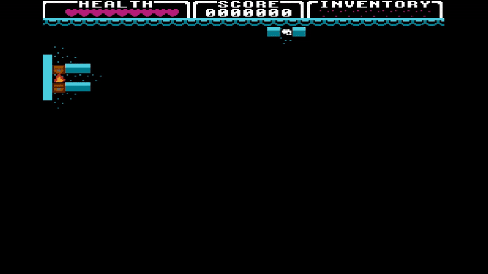
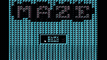
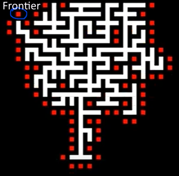
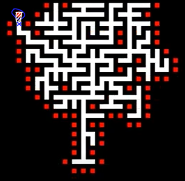
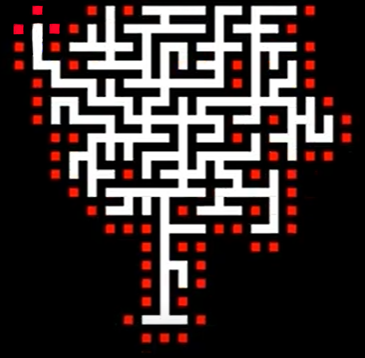

# NES Maze Game

## Intro

The NES Maze Game is a maze navigation game inspired by classic titles from the golden era of gaming. Designed for the Nintendo Entertainment System (NES), it offers players the chance to navigate through intricate mazes in different modes.

Players can enjoy the game on original NES hardware or through a compatible NES emulator, making it accessible to a wider audience of retro gaming enthusiasts.


## Table of Contents
1. [Intro](#intro)
2. [About The Project](#about-the-project)
3. [How To Play](#how-to-play)
   - [Gamemodes](#gamemodes) 
   - [Title Screen Controls](#title-screen-controls)
   - [In-Game Controls](#in-game-controls)  
   - [Objective](#objective)  
4. [Technical Information](#technical-information)
   - [Building Project](#building-project)
   - [Graphics](#graphics)
   - [Data Structures](#data-structures)
   - [Maze Generation](#maze-generation)
      - [Random Numbers](#random-numbers)
   - [Maze Solving](#maze-solving)
5. [Used Software](#used-software)
6. [References](#references)  
   - [Sources](#sources)  
   - [Initial Project](#initial-project)  

## About The Project
The project started a as a [group project](#initial-project) for a DAE course, where the goal was to create a better understanding of low level programming and learn 6502 assembly for the NES. Since then I've continued the project and added more features.

The project explores Maze generation in a low level programming language, you can play easy mode (no darkness), hard mode (darkness) and auto mode, which uses a solving algorithm.

Currently the project isn't really much of a game as you can only solve the Maze, and there's no enemies yet. Inb the future I would like to add some enemies in the maze to add more difficulty and gameplay.

## How To Play

To play the game if you don't have a NES, you need an emulator, we have tested the game in Mesen and FCEUX but other emulators may also work when they support PAL mode. If you do have a NES you will need a way to upload the NES file to a cartridge (Everdrive, ...)

### Gamemodes

- **Hard**: Hard mode stops displaying the maze once it's been generated and has has the player looking for their way out using a classic "Fog of War" system.



- **Auto**: The auto gamemode disables player input (in hardmode) and uses solving algorithms to solve the maze. This allows you to sit back and enjoy the satisfying animation. Starting in auto mode with the hard flag enabled uses the Left Hand Rule solving algorithm, without it uses a Breadth First Search.




### Title Screen Controls

- **DPAD UP**: Move selection up
- **DPAD DOWN**: Move selection down
- **SELECT**: Select a menu item
- **START**: Start the game with the current selections

### In-Game Controls

- **START**: Pause the game
- **DPAD**: Move up, right, down, or left
- **A**: Open chest

### Objective

Navigate through the maze and reach the end to complete the level.

## Technical information
In this section we will cover a lot of the technical details for the project.

### Building project
To build the project (I am using a VS Code terminal in this case, but any terminal will work) run the folliwng command in a terminal: 
```bash
Setup\build.bat Maze
```

Having a 6502 compiler installed is a requirement for this to work, we used [CC65](https://cc65.github.io/).

### Graphics
split scrolling "hack" for HUD
score
animations

uses changed tiles buffer -> more specifics there

### Data structures

#### Buffers
Buffers (arrays) are the most commonly used data structure throughout the project, a few different ones are defined:
- Changed Tile Buffer
- Chest Buffer
- Direction Buffer
- Frontier List
- Map Buffer
- Start Screen Buffer
- Torch Buffer
- Visited Buffer

Generally, most of these buffers work in a similar way, with a few differences as to how they're accessed and used.

##### Changed Tile Buffer
This buffer is used for graphics (more info in that section), this will just cover how the buffer itself works.
The buffer contains the row and column of the tile on the background. It Stores 3 bytes per tile, high byte of location low byte of location and the tile from the tilesheet we're using. There's also 2 different buffers, one for each nametable.

##### Chest and torch buffer
These simply store a row and column in a buffer.

##### Start Screen buffer and Frontier List
These work in a similar way as the previously mentioned buffers, but the start screen buffer acts a little different as it is actually 3 buffers since a lot of data needs to be stored. The frontier list also has some additional macros that work closely together with the map buffer (see. how the maze generation works).

##### Map, Direction, Visted buffer
These all store information about the map, but to safe space the buffers have been optimized quite a bit.</br>
**Map Buffer**</br>
For the map buffern very tile corresponds with one bit: wall or path.

```text
;Column: 0123 4567  89...
; Row 0: 0000 0000  0000 0000   0000 0000   0000 0000   0000 0000
; Row 1: 0000 0000  0000 0000   0000 0000   0000 0000   0000 0000
;...
```

**Direction Buffer**</br>
The direction buffer works the same as the map buffer, but there are 2 bits per tile: direction 0-3.

**Visited Buffer**</br>
The visited buffer works the same as the map buffer, but instead of storing whether or not it's a wall, it stores if the cell has been visited (solving algorithm) or if it is visible to the player (hardmode).

#### Queue
The queue is a circular queue to avoid the moving of memory (limited possibility to do this in 6502). Make sure the queue capacity that is reserved is sufficient when using this for certain algorithms that require you to maintain all items in the queue.

*Note: the queue uses one extra byte at the end to be able to distinguish between full and empty without storing additonal flags / adding extra loggic (N-1 usable slots)*

Example of how the queue data structure works: 
```text
Initial state - empty: 
queue_head = 0
queue_tail = 0

Enqueue 42
queue_head = 0
queue_tail = 1
[ 42 ][ ?? ][ ?? ]

Enqueue 43
queue_head = 0
queue_tail = 2
[ 42 ][ 43 ][ ?? ]

Dequeue 
queue_head = 1
queue_tail = 2
[ ?? ][ 43 ][ ?? ]

Example of what happens when we need to wrap around in the circular queue: 
initial state: 
queue_head = 1
queue_tail = 4
[ ?? ][ 43 ][ 50 ][ 60 ][ ?? ] 

Enqueue 70 
queue_head = 1 
queue_tail = 0 - wrapped around to 0
[ 70 ][ 43 ][ 50 ][ 60 ][ ?? ]  ; note: last slot remains [??] - reserve one to distinguish between empty and full
```

### Maze generation
For the maze generation I used Prim's algorithm. It works the following way. 

Pick a random grid cell and set its state to passage (walkable), then calculate the Frontier cells for this cell. Frontier cells are cells at distance 2 that are blocked.

The rest of the algoritm simply recursively does this: 
- Pick a random Frontier cell.
- For all walkable neighbors of the Frontier cell (distance 2), pick a random neighbor and connect the Frontier cell with the neighbor. Now calculate new Frontier cells for the Frontier cell that was picked. (also remove the now used Frontier cell)

For Prim's algorithm we simply need a Frontier list that allows random access.







#### Random numbers
To make this work, we need random number generation which we do the follow way: a random seed is stored in ZPG and we increase the seed as many times as we can during a frame (this results in more randomness).

Then a very simple calculation is done whenever a random number is needed.

```asm6502
; takes the current random seed and adjusts it based on the current frame
; if this adjustment happens to be 0 its incremented to ensure we never end up with a random seed of 0 (may cause issues in saoe cases)
.segment "CODE"
.proc random_number_generator
    @RNG:
        LDA random_seed
        EOR frame_counter ; XOR with a feedback value

        BNE :+
        ; If the random seed is 0 -> increase to 1
            INC random_seed ; ensure its non zero
        :
        STA random_seed  ; Store the new seed
    RTS 
.endproc
```

### Maze solving

#### Left Hand Rule
The first solving algorithm that was implemented is a very simple one, you just always keep your left hand on the wall until you reach the exit.

#### Bread-First Search
The second algorithm that was implemented is more complicated, especially on older hardware like this. It is a BFS algorithm. You explore all unvisited walkable neighbors, if none are the goal tile, you continue exploring all the of the furthest exlored tiles until the goal was found.

In order for the BFS algorithm to work we need to track a visited list (easy since it is a grid) and a queue with the cells we're currently exploring.

## Used Software
**Graphics:**
- [YY-CHR](https://wiki.vg-resource.com/YY-CHR)
- [NEXXT Studio 3](https://frankengraphics.itch.io/nexxt)

**Audio:**
- [FamiStudio](https://famistudio.org/)

**Coding & Debugging:**
- [Visual Studio Code](https://code.visualstudio.com/)
- [Mesen](https://www.mesen.ca/) and [MesenX](https://github.com/NovaSquirrel/Mesen-X) (debugging and emulating)
- [FCEUX](https://fceux.com/web/home.html) (debugging and emulating)

## References

### Sources

For the controller input on the NES there are some things to consider if you use DPCM samples, to ensure this won't be an issue I used the following [source](https://www.nesdev.org/wiki/Controller_reading_code).

The split scrolling for the HUD is done using the old trick from Super Mario Bros 3 since I was not using a mapper that supports scanline interrupts at the time and the HUD is at the top row [source](https://retrocomputing.stackexchange.com/questions/1898/how-can-i-create-a-split-scroll-effect-in-an-nes-game).

For the Maze generation: [Stackoverflow post explaining the algoritm](https://stackoverflow.com/questions/29739751/implementing-a-randomly-generated-maze-using-prims-algorithm)

### Initial Project

The initial project was made during a class in a [DAE](https://www.digitalartsandentertainment.be/page/31/Game+Development) course (Retro Console & Emulator Programming) given by Tom Tesch.

**We used the following book in that class to setup the project:** </br>
Cruise, Tony. (2024). </br>
Classic Programming on the NES. </br>
Manning Publications Co.</br>
ISBN: 9781633438019.

For more information, or to view the original project, please visit the project repository [here](https://github.com/thegamingnobody/AssemblyMaze).